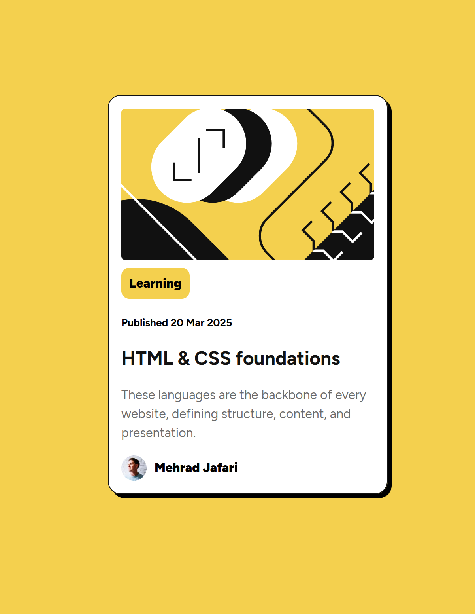

# Blog Preview Card

This is a **Blog Preview Card** component built with **HTML & CSS**. It is designed to display a simple blog preview with an image, title, description, and author information.

## 📌 Features
- Responsive layout using **CSS**
- Uses **Google Fonts (Figtree)** for modern typography
- Well-structured **HTML** with semantic elements
- Mobile-friendly design

## 🛠 Technologies Used
- **HTML5** for the structure
- **CSS3** for styling
- **Google Fonts** for typography

## 📁 Project Structure
```
├── assets/
│   ├── images/
│   │   ├── illustration-article.svg
│   │   ├── favicon-32x32.png
│   │   ├── image-avatar.webp
│   │   ├── Screenshot.png
│   ├── style.css
├── index.html
```

## 🚀 How to Use
1. Clone the repository:
   ```sh
   git clone https://github.com/your-username/blog-preview-card.git
   ```
2. Open `index.html` in a web browser.

## 📷 Preview
This is how the blog preview card looks:



## 🌐 Live Demo
Check out the live version here: [Blog Preview Card](https://mehradj.github.io/blog-preview-card-main/)

## 📝 Author
- **Mehrad Jafari**

## 📜 License
This project is intended for educational and practice purposes and is free to use.

